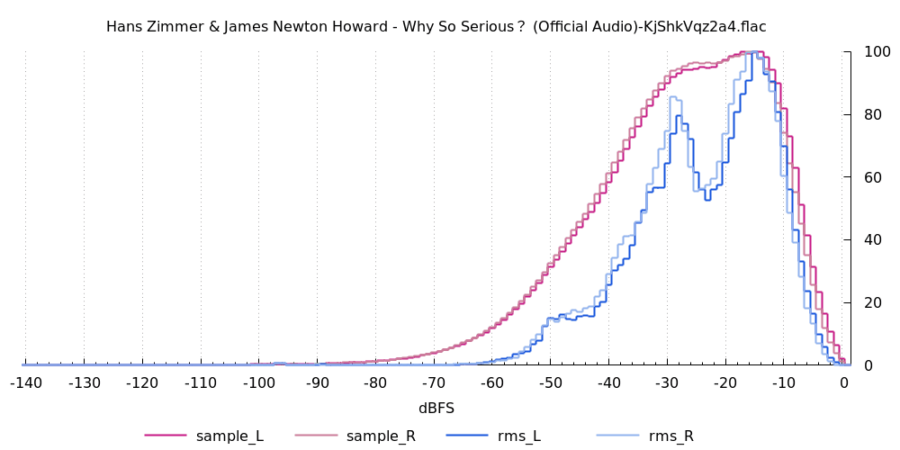

**Table fo Contents**

<div id="user-content-toc">

* [Intro](#intro)
* [Usage](#usage)
* [Examples](#examples)

</div>

# Intro

`audio_histogram` is a program that generates histogram data of samples and RMS values. [libsndfile](https://libsndfile.github.io/libsndfile/) is required to build it.

`plot_audio_histogram` is a script that calls `audio_histogram` and plots the data to PNG file using gnuplot.

# Usage

```
]$ ./audio_histogram -h
Usage:
  audio_histogram -i FILE -o FILE

    -i | --input FILE      - input audio file
    -o | --output FILE     - output file

Generate histogram of samples and RMS values.

50ms window is used for calculating RMS values. Histogram values are normalized
so that max value is 100.

Bucket 1 covers all values greater than 0 dBFS, bucket -140 covers all values
lower or equal -140 dBFS
```

```
]$ ./plot_audio_histogram -h
Usage:
  plot_audio_histogram -i INPUT_FILE [optional arguments]

  Required:
    -i | --input INPUT_FILE     - input file

  Optional:
    -o | --output OUTPUT_FILE   - output file (default is same as input with
                                  the extension changed to "png")
    -F | --force                - force overwrite output file

    -t | --title TITLE          - title (default is "artist / album / title" or
                                  the filename if metadata is not available)
    -s | --size SIZE            - size (default is 1000x500)

    -h | --help                 - this help message

The script calls audio_histogram to generate sample and rms histogram data and
plots it to PNG file using gnuplot.

Metadata for the title is read using ffmpeg if it is available.
```

# Examples

[Adele - Hello](https://www.youtube.com/watch?v=Ei8UnOPJX7w)


[Paper Motion - Grey One](https://www.youtube.com/watch?v=ZEGub4suYUI&list=OLAK5uy_nr6p7xLYSgglUBJxe9rxnWHsMugePFoPo)


[The Dark Knight - Why So Serious?](https://www.youtube.com/watch?v=KjShkVqz2a4)


